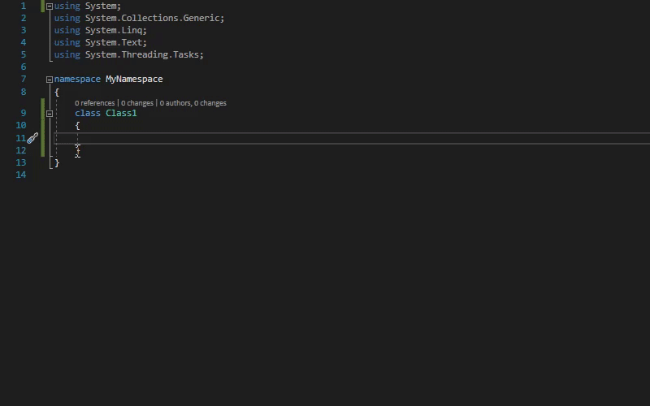
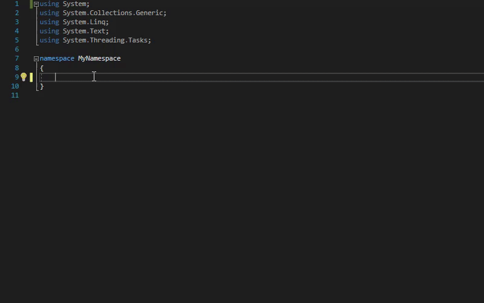

# RevitAPISnippets

Revit API snippets for Visual Studio.

## Installation

1. [Download](https://github.com/mayconrfreitas/RevitAPISnippets/archive/refs/heads/main.zip) or [clone](git-client://clone?repo=https%3A%2F%2Fgithub.com%2Fmayconrfreitas%2FRevitAPISnippets) this repo;
2. On Visual Studio, go to `Tools > Code Snippets Manager...` or press `Ctrl + K` and `Ctrl + B`;
3. Click on `Add` button.
4. Navigate to the folder where you saved this repo;
5. Open the repo [`Folder > Snippets`](./Snippets/) and Select the RevitAPI folder according to your Revit version (E.g.: [`RevitAPI2020`](./Snippets/RevitAPI2020/));
6. Click on `OK`.

## How to use

1. After installation, type the command (as in the [Snippets List](#snippets)) `command` and press `tab` 2x;

	

2. Use `tab` to navigate through fields and edit them as you wish;

	

3. Press `enter` to complete the command.

---

## Snippets

List of snippets ready to use:

Command                                                                                         | Description
------------------------------------------------------------------------------------------------|------------------------------------------------------------------------
[rvtiexcom](./Snippets/RevitAPI2020/CreateIExternalCommand.snippet)                             | Creates a sample of a IExternal Command implemented with the main codes.
[rvtallinstcat](./Snippets/RevitAPI2020/Collector/CollectAllInstancesByCategory.snippett)       | Collects all instances in the project by the builtin category.
[rvtalltypescat](./Snippets/RevitAPI2020/Collector/CollectAllTypesByCategory.snippet)           | Collects all element types in the project by the builtin category.
[rvtgetparamdoub](./Snippets/RevitAPI2020/Parameters/GetParameterValueAsDouble.snippet)         | Gets a parameter value as a double.
[rvtgetparamelmid](./Snippets/RevitAPI2020/Parameters/GetParameterValueAsElementId.snippet)     | Gets a parameter value as an ElementId.
[rvtgetparamint](./Snippets/RevitAPI2020/Parameters/GetParameterValueAsInteger.snippet)         | Gets a parameter value as an integer.
[rvtgetparamstr](./Snippets/RevitAPI2020/Parameters/GetParameterValueAsString.snippet)          | Get Parameter Value As String.
[rvtgetparamvalstr](./Snippets/RevitAPI2020/Parameters/GetParameterValueAsValueString.snippet)  | Get Parameter Value As Value String.
[rvtsetparam](./Snippets/RevitAPI2020/Parameters/SetParameterValue.snippet)                     | Set Parameter Value.
[rvtsetparamstr](./Snippets/RevitAPI2020/Parameters/SetParameterValueString.snippet)            | Set Parameter Value String.
[rvtselfilt](./Snippets/RevitAPI2020/Selection/CreateSelectionFilter.snippet)                   | Creates a sample of a Selection Filter code implementing ISelectionFilter interface.
[rvtgetsel](./Snippets/RevitAPI2020/Selection/GetSelectedElements.snippet)                      | Gets the elements in the model.
[rvtpickelms](./Snippets/RevitAPI2020/Selection/SelectElements.snippet)                         | Creates a selection of elements in the model.
[rvttrans](./Snippets/RevitAPI2020/Transactions/CreateTransaction.snippet)                      | Creates a sample of a Transaction code.

---

## Contributors

If you have any snippets that you think might be interesting to share, follow the steps below to contribute to this project:

### Instructions
1. [Fork](https://github.com/mayconrfreitas/RevitAPISnippets/fork) this repo;
2. Use the `template` inside [`Snippets > Templates > Charp.snippet`](./Snippets/Templates/Charp.snippet);
3. Use the **prefix** `rvt` to name your **shortcut** (E.g.: `rvt` + `getsel` (abbreviation to Get Selection) = [`rvtgetsel`](./Snippets/RevitAPI2020/Selection/GetSelectedElements.snippet));
4. **Be sure** that your shortcut doesn't exist in the [Snippets List](#snippets);
5. Write your snippets in **individual files** grouped inside folders of their **respective subject** (E.g.: [rvtselfilt](./Snippets/RevitAPI2020/Selection/CreateSelectionFilter.snippet) is inside [Selection](./Snippets/RevitAPI2020/Selection/) folder);
6. `Commit` and `Push` your changes to your forked repo;
7. Send a `Pull Request` to [Develop branch](https://github.com/mayconrfreitas/RevitAPISnippets/tree/develop).

### More Information

For more information, feel free to contact me via email `mayconrfreitas@gmail.com` or [LinkedIn](https://www.linkedin.com/in/maycon-freitas/).

---

## License

This project is [licensed](LICENSE) under the [MIT Licence](https://en.wikipedia.org/wiki/MIT_License).

---

Do you like this solution? Please [star this project on GitHub](../../stargazers)!